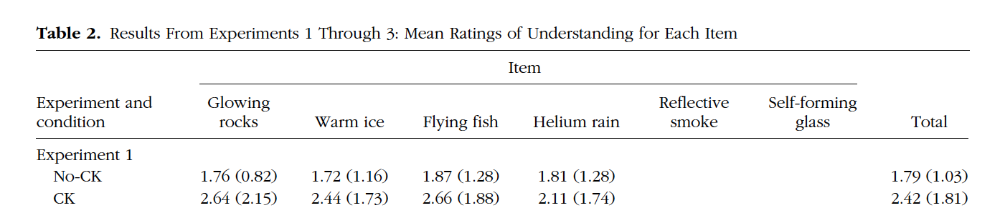

##Introduction 

Sloman 2016's paper describes 4 studies assessing a “community of knowledge.” A community of knowledge is the perception that because others understand something, I also understand it. This effect is seen when other’s knowledge increases my own sense of understanding of something. Participants in this study were told they were in a study about recent scientific discoveries, and participants read descriptions of newly discovered phenomena and rated their own understanding (1-7 scale). Half of these descriptions indicated that scientists had explained these new phenomena, while the other half of these descriptions indicated that these new phenomena were still poorly understood and therefore unexplained. In all four studies, Sloman & Rabb found evidence for a community of knowledge: when scientific discoveries were described as being fully understood and completely explained by scientists, participants rated that they understood these discoveries better - even when no explanation of the scientific discoveries was provided.

This project will replicate study 1, which presented descriptions of newly discovered scientific phenomenon that were described as either understood and explained or not understood and unexplained. Sloman & Rabb found that ratings of understanding were generally low (Ms = 1.79(unexplained) and 2.42(explained)), but a paired samples t-test revealed that understanding was significantly higher in the explained condition: (M=.28, 95% CI = [0.21, 0.35]) than in the unexplained condition: (M=0.20, 95% CI = [0.15, 0.25]), t(69)=-3.40, p=.001, Cohen’s d=0.43). 


##Methods 

Methods adapted from Rosenthal & Rabb 2016, page 1452.

Participants will be recruited using Amazon's Mechanical Turk in return for a small payment. The instructions will explain in detail how to use a rating scale to reflect a sense of causal understanding. A cover story will indicate that the study concerns recent scientific discoveries. Participants will read four fictional descriptions of newly discovered natural phenomena and rate their understanding on a scale from 1 to 7 (1= little to no understanding, 7=detailed and deep understanding). Each participant will read two descriptions indicating that a given phenomenon has been thoroughly explained by the discovering scientists (communal knowledge condition) and two indicating that it has not yet been explained (no communal knowledge condition). The order of items and conditions will be fully counterbalanced. Participants will also answer a question about mood as an attention check. 

###Power Analysis 

Power analysis based on: 

> A paired-samples t test of the log-transformed ratings of understanding revealed that they were significantly higher in the CK condition (M = 0.28, 95% confidence interval, or CI = [0.21, 0.35]) than in the no-CK condition (M = 0.20, 95% CI = [0.15, 0.25]), t(69) = −3.40, p = .001, Cohen’s d = 0.43.

Original effect size: d=.43
Power analysis for samples to achieve same effect size:
80% power: n=45
90% power: n=59
95% power: n=73
Considerations of feasibility for selecting planned sample size: Very feasible to run 45 participants for 80% power.

###Planned Sample 

Planned sample size: 45
Data will be excluded for failing manipulation check.
12/82 (14.6%) of original sample failed manipulation check, so should plan to inflate sample size by at least 15% and therefore will run 55 participants to be safe.

###Materials

Materials are eight descriptions of scientific discoveries: 4 that indicate a community of knowledge and 4 that don't indicate a community of knowledge. 

> 
A May 19, 2014 study in the journal Geology reported the discovery of a new rock that scientists have not yet explained. The rock is similar to calcite, yet it glows in the absence of a light source. The authors of the study, Rittenour, Clark, and Xu, do not yet understand how it works; they provided a description of the remarkable appearance of the mineral and outlined future experiments.
How well do you understand how glowing rocks work?	

> A May 19, 2014 study in the journal Geology reported the discovery of a new rock that scientists have thoroughly explained. The rock is similar to calcite, yet it glows in the absence of a light source. The authors of the study, Rittenour, Clark, and Xu, fully understand how it works; they provided a description of the remarkable appearance of the mineral and outlined future experiments.How well do you understand how glowing rocks work?

> The journal Ecology Letters recently reported a rare weather subsystem that scientists have not yet explained (“Liquified 2He clouds form near the Cape of Good Hope,” Marchetti, May 28, 2014). This weather system effectively rains liquid helium. The author of the study does not understand how it works, but she described the visual appearance of the helium rain and discussed additional measures to be taken next year. How well do you understand how liquid helium weather systems work?	

> The journal Ecology Letters recently reported a rare weather subsystem that scientists have thoroughly explained (“Liquified 2He clouds form near the Cape of Good Hope,” Marchetti, May 28, 2014). This weather system effectively rains liquid helium. The author of the study fully understands how it works; she described the visual appearance of the helium rain and discussed additional measures to be taken next year. How well do you understand how liquid helium weather systems work?

> An April 3, 2014 study in the journal Nature reported the discovery of a species of fish that scientists have not yet explained. The unusual fish is similar to Xiphosphorous Nigrensis but effectively can fly. The authors of the study, Danica and Frith, do not understand how it flies; they provided a visual description of the body of the fish and discussed further directions of research. How well do you understand flying fish?	

> An April 3, 2014 study in the journal Nature reported the discovery of a species of fish that scientists have thoroughly explained. The unusual fish is similar to Xiphosphorous Nigrensis but effectively can fly. The authors of the study, Danica and Frith, fully understand how it flies; they provided a visual description of the body of the fish and discussed further directions of research. How well do you understand flying fish?

> The journal Science recently reported a protein-like ice crystal that scientists have not yet explained (“Hexagonal crystalline structure in moderate environments,” Arden, Kayas-Gupta, & Overby, June 4, 2014). The ice crystal forms even in warmer temperatures. The study’s authors do not understand how it works, but they described the visual appearance of the crystals and proposed future avenues of research. How well do you understand how warm ice formations work?	

> The journal Science recently reported a protein-like ice crystal that scientists have thoroughly explained (“Hexagonal crystalline structure in moderate environments,” Arden, Kayas-Gupta, & Overby, June 4, 2014). The ice crystal forms even in warmer temperatures. The study’s authors fully understand how it works; they described the visual appearance of the crystals and proposed future avenues of research. How well do you understand how warm ice formations work?

###Procedure	

> "Eighty-two U.S. residents (40% female, 60% male; mean
age = 31.3 years) were recruited using Amazon’s Mechanical
Turk and participated in return for a small payment.
Sample size was chosen to satisfy counterbalancing
schemes and was in keeping with related prior research.
The instructions, adapted from Rozenblit and Keil (2002),
explained in detail how to use a rating scale to reflect a
sense of causal understanding. A cover story suggested
that the study concerned recent scientific discoveries.
Participants read four fictional descriptions of newly discovered
natural phenomena and rated their understanding
(“How well do you understand how ___ works?”) on
a scale from 1 to 7 (1 = little to no understanding, 4 =
moderate understanding, and 7 = detailed and deep
understanding). Each participant read two descriptions
indicating that a given phenomenon had been thoroughly
explained by the discovering scientists (communal
knowledge, or CK, condition) and two indicating that it
had not yet been explained (no-CK condition; see Table 1
for examples). The order of items and conditions was
fully counterbalanced. Details about the scientists and
reporting journals were included to camouflage the
manipulation, but the descriptions contained no causal
or explanatory information. Participants then answered a
question about mood that was incorporated as an attention
check."

The only exception to the original article will be the number of participants recruited for the study. 

###Analysis Plan

Analysis plan:
Participants who fail the manipulation check will be excluded from analyses.
Means for ratings of understanding of both conditions will be calculated. Assuming these responses will be positively skewed (representing relatively low understanding), a log transformation will be used to increase the normality of the scores.
(Key analysis of interest): A paired samples t test of the log transformed scores will then be calculated to assess if understanding is significantly higher in one condition than the other. Confidence intervals and effect size will also be calculated. 

###Differences from Original Study

We will be recruiting a different, smaller sample size than in the original study based on a power calculation based on the effect size found in the original study. Additionally, the original study does not specify whether the survey was coded on Qualtrics or directly on Amazon mTurk, so it is possible that running the study on Qualtrics would be a difference from the original study. Finally, the authors do not specify exactly how the original counterbalancing was done, so this reproduction will use our judgment to try and best randomize and counterbalance the presentation of stimuli. 

I do not anticipate that these differences will influence our ability to reproduce effects from the original study.

###Pilot A (added in by KL)

I ran 4 pilot participants to ensure the directions worked well and that things randomized properly. After piloting I made some changes to page breaks, and in the end the randomization worked and everything went smoothly. The order that stimuli appeared for each of the four participants were as follows:

weather not explained
fish not explained 
ice explained
rock explained
attn check

weather explained
ice explained
fish not explained
rock not explained
attn check

attn check
ice explained
weather explained
fish not explained
rock not explained 

fish explained
ice explained
attn check
weather unexplained
rock unexplained


#### Actual Sample
  Final sample included 61 participants (56% male, 43% female).

#### Differences from pre-data collection methods plan
  The final number of participants (61) was larger than the initially planned number of participants (45) due to a relatively lower percentage of participants failing the attention check and being excluded from the data than in the original study (original study: 12/82 = 14.6%, our study: 3/64 = 4.6%).


##Results


### Data preparation
	
```{r include=F}
###Data Preparation

####Load Relevant Libraries and Functions
library(tidyverse)
library(ggthemes)
library(knitr)
library(kableExtra)
sem <- function(x) {sd(x, na.rm=TRUE) / sqrt(sum(!is.na((x))))}
ci <- function(x) {sem(x) * 1.96} # reasonable approximation 
library(effsize)
library(lme4)
library(stargazer, quietly = TRUE)

####Import data
setwd("~/Desktop/251/Sloman2016/writeup/Sloman2016")
dx <- read.csv("251 Replication_December 12, 2017.csv")

#### Data exclusion / filtering

d <- dx %>%
  filter (attn != 0)
#coded attention check as 1 if pariticpants passed and 0 if they failed, this is filtering out all who failed attention check

#### Prepare data for analysis - create columns etc.

#creating variable for condition  - need to update dx to d when get real data (dx includes even people who failed manipulation check)


dtable <- dx %>%
  select(ResponseId, starts_with('ck'), starts_with("nock")) %>% #selecting relevant variables
  gather(Question, response, -ResponseId) %>% #organizing them by stimuli
  group_by(Question) %>% #grouping by stimuli
  mutate(condition=Question) #creating ck or nock conditions

dtable$condition <- gsub("_ice", "", dtable$condition) #dropping stimuli specific words to make overall ck or nock conditions
dtable$condition <- gsub("_weather", "", dtable$condition)
dtable$condition <- gsub("_rock", "", dtable$condition)
dtable$condition <- gsub("_fish", "", dtable$condition)

dtable$Question <- gsub("ck_", "", dtable$Question)
dtable$Question <- gsub("no", "", dtable$Question)

dtable


```


### Confirmatory analysis

```{r analyses}
  
#Recreating Table 2 from original paper #have all the information in here but still working on making it nice with kable
dtablesummary <- dtable %>%
  group_by(Question, condition) %>%
  summarise(mean = mean(response, na.rm=TRUE), sd = sd(response, na.rm=TRUE)) %>%
  group_by(condition, Question, mean, sd) %>%
  summarise()
dtablesummary

```


*original*

```{r table}
knitr::kable(dtablesummary, digits = 2)
```

*replication*


```{r confirmatory continued}

#making table of total means by condition
dtabletotal <- dtable %>%
  group_by(condition) %>%
  summarise(mean = mean(response, na.rm=TRUE), 
            sd = sd(response, na.rm=TRUE), 
            ci=ci(response)) 
dtabletotal


#Getting log averages by conditions for each subject
dlog <- dtable %>%
  group_by(ResponseId, condition) %>%
  summarise(mean = mean(response, na.rm=TRUE)) %>%
  mutate(log_understand = log(mean)) %>%
  spread(condition, log_understand) %>%
  group_by(ResponseId) %>%
  summarise(meanck = mean(ck, na.rm=TRUE), meannock = mean(nock, na.rm=TRUE))
dlog

#calculating mean log transformed understanding ratings
mean(dlog$meanck)
mean(dlog$meanck)-ci(dlog$meanck)
mean(dlog$meanck)+ci(dlog$meanck)

mean(dlog$meannock)
mean(dlog$meannock)-ci(dlog$meannock)
mean(dlog$meannock)+ci(dlog$meannock)
  

#STATISTIC OF INTEREST: paired t test on log transformed means of understanding
t.test(dlog$meannock, dlog$meanck, paired=TRUE)
# effect size
cohen.d=cohen.d(dlog$meanck, dlog$meannock, paired=TRUE)
cohen.d

#plot (not a replication of experiment 1 in the original paper but a replication of a plot of other, similar experiments)
#note: tried to adjust aspect ratio but every time I tried to specify it (using either coord_fixed or coord_equal) it cut off the axes based on the data (so the y axis went from 1 to 3)
dtabletotal$condition <- c("CK", "No CK") #renaming this variable 

ggplot(dtabletotal, aes(x=condition, y=mean, fill=condition)) +
  geom_bar(stat="identity") +
    geom_errorbar(aes(ymin = mean - ci, ymax = mean + ci),
                width = 0.25) + 
  ylab("Mean Understanding") + xlab ("Condition") +
  scale_fill_ptol() +  
  theme(panel.grid.major = element_blank(), panel.grid.minor = element_blank()) + 
  theme(panel.border = element_blank()) + 
  theme(axis.line = element_line(colour = "black"))  + 
  ggtitle("Mean Understanding Based on \n Community Knowledge (CK)") + 
  theme_minimal() + 
  theme(legend.position="none") + 
  theme(plot.title = element_text(hjust = 0.5, size=rel(1.5)))+
  theme(axis.text.x=element_text(size=rel(.8)))+
  theme(axis.title.x=element_text(size=rel(1)))+
  theme(axis.title.y=element_text(size=rel(1))) +
  coord_cartesian(ylim=c(1,7))
```


###Exploratory analyses

```{r exploratory}

#demographics
table(d$gender)
#56% male, 43% female

#looking at interaction with gender - an interaction by gender would be interesting (i.e. are women or men more likely to say they understand something?)

genderdata <- dx %>%
  select(ResponseId, gender) %>%
  filter(gender !=4)

gendertable <- full_join(genderdata, dtable, by="ResponseId")

genderinteraction <- lm(response~condition*gender, data=gendertable)
summary(genderinteraction)

genderlm <- lm(response~gender, data=gendertable)
summary(genderlm)

#no significant relationship between gender and ratings of understanding

```

```{r mixed effects model}

#Here I am following the suggestion raised in class to look at a mixed model to assess whether ratings of understanding differed across the different stimuli used. I have very little experience running mixed effects models and thus am unsure if this was the best way to assess these models to answer that question. 

dtable2 <- dtable
dtable2$Question[dtable2$Question == "fish"] <- 1
dtable2$Question[dtable2$Question == "ice"] <- 2
dtable2$Question[dtable2$Question == "rock"] <- 3
dtable2$Question[dtable2$Question == "weather"] <- 4
dtable2$Question <- as.numeric(dtable2$Question)

#regular lm model looking at effect of condition on response
lm1 <- lm(response~condition, data=dtable2)
summary(lm1)

#lm model looking at effect of condition on response with an interaction by Question type
lmer1 <- lm(response~condition*Question, data=dtable2)
summary(lmer1) #significant interaction between Question type and condition on response
anova(lmer1, lm1) #anova reveals that the interaction model is significantly better than the regular lm

lmer2 <- lmer(response~condition*Question + (1 | Question), data=dtable2)
summary(lmer2)

anova(lmer2, lmer1) #difference in AIC is very small, lmer1 (the model without random effects) seems to be the better model only slightly; it appears that adding in Questions as a random slope to the model does not make the model significantly better 

lmer3 <- lmer(response~condition*Question + (1 + Question | Question), data=dtable2)
summary(lmer3)

anova(lmer3, lmer2) #difference in AIC is still very small, lmer2 (the model without random effects) seems to be the better model only slightly; it appears that adding in Questions as a random intercept in addition to random slope to the model does not make the model significantly better 

```

```{r lm1, results = 'asis', warning=FALSE, message=FALSE}

stargazer(lm1, type = 'html')
stargazer(lmer1, type = 'html')
stargazer(lmer2, type = 'html')
stargazer(lmer3, type = 'html')

```


## Discussion

### Summary of Replication Attempt

On one hand, this experiment replicated: when the responses were collapsed across CK and No-CK conditions, as in the original paper, and compared using a t test, ratings of understanding were significantly higher in the CK condition than in the No-CK condition. However, there were several notable differences in the findings between this study and the original study. In the original study, Sloman & Rabb found that ratings of understanding for all four of the stimuli were rated as lower in the No-CK condition. In this replication, however, two of the four stimuli (those concerning flying fish and ice formations) received higher ratings of understanding in the No-CK condition than in the CK condition. Thus, I would overall clarify this as a partial replication, as Sloman & Rabb's theory should not have led to any differences by stimuli, and all stimuli in the No-CK condition should have led to less understanding than all stimuli in the CK condition. 


### Commentary

To further investigate the issue of certain stimuli items leading to higher ratings of understanding in the No-CK than in the CK conditions, I examined both an interaction between the stimuli and the condition on responses and a mixed effects model looking at stimuli as a random slope or a random intercept and a random slope. I do not believe the mixed effects models proved to be significantly better than the interaction model (based on the anovas I ran to compare the models), but an interaction model did indicate a significant interaction between stimuli items (Questions) and condition (CK or No-CK) on ratings of understanding (responses). According to Sloman & Rabb's theory, there should not have been an interaction between stimuli and condition, as ratings of understanding should have been the same across stimuli within condition. 

Whether my replication findings represent random noise is an open question, as this study was only 1 of 4 run by Sloman & Rabb supporting their hypothesis for a community of knowledge. However, to fully answer this question it seems that it would be necessary to run an additional replication with a greater number of different stimuli to eliminate the possibility of effects by various stimuli. 

This replication was conducted in a way that matched the original study as much as possible, including using the same attention check and stimuli. As such, this finding (that overall the findings replicated, but with some interesting caveats), represents an area of necessary further exploration for understanding the theory set out by Sloman & Rabb in their paper. 